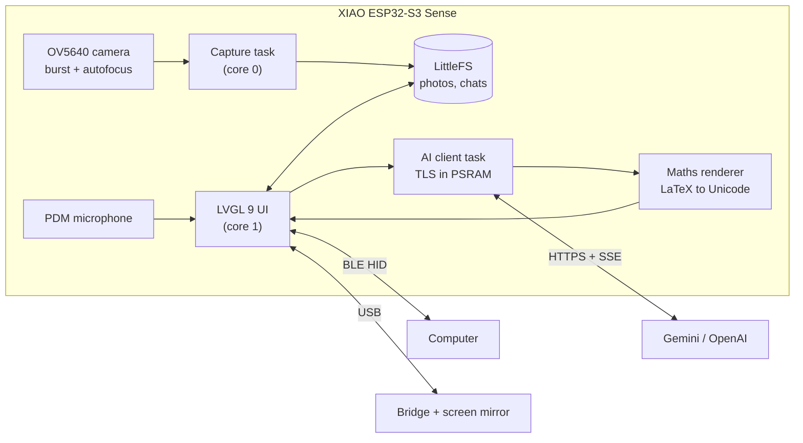

<div align="center">

# Perch

**A pocket-sized camera that reads what you point it at and answers on its own screen.**

Photograph a worksheet, a whiteboard or a screen, ask a question by typing or by voice,
and the answer streams onto a 240 × 284 touch display, with real maths symbols.


</div>

---

## Highlights

|  |  |
| --- | --- |
| **Chats with photos** | Attach pictures from the camera or the gallery. Replies stream in word by word and keep arriving even if you switch to another chat. |
| **Two AI providers** | Gemini and OpenAI models with per-provider model and effort settings, automatic fallback when a model is overloaded, and a daily request limit. |
| **Upload once** | Each photo is uploaded once per conversation (Gemini Files API) and referenced by link afterwards, so follow-up questions send about 1.5 KB instead of 300 KB. |
| **Real maths** | LaTeX in any delimiter style, ASCII like `7*(6*m+1)` and plain Unicode all render as x², √, ∫₀¹, ≤, ½ using custom fonts with 471 glyphs. |
| **Sharp capture** | OV5640 autofocus, a two-frame burst that keeps the sharpest frame, and exposure capped for hand-held use. |
| **Works offline** | Questions asked without Wi-Fi are queued and sent when the connection returns. |
| **More than a camera** | Bluetooth keyboard remote for slides and media, a camera gesture mode, Wi-Fi setup on the device, Control Center, screen sleep. |
| **Private by design** | Privacy light while anything is recorded or sent, "Forget last hour" that also deletes uploaded copies, API keys never compiled in. |
| **Signed updates** | Over-the-air updates verified with SHA-256 and an ECDSA P-256 release signature before they can boot. |

## How it works



**Capture.** The live view runs at ~27 FPS in a 320 × 240 RGB565 mode with continuous
autofocus. Pressing the shutter freezes the lens, switches the sensor to 2048 × 1536 JPEG,
takes two frames and keeps the sharper one (Laplacian variance, normalised for brightness),
then returns to the live view while a background task saves the photo.

**Asking.** A chat is sent the way chat apps talk to stateless APIs: the recent messages as
alternating turns with a system instruction, plus the newest photos. Requests run on their
own FreeRTOS task so the interface never blocks. Answers stream over server-sent events and
are drawn as they arrive. Overloaded models (HTTP 500/503) are skipped for ten minutes,
per-day quotas fall through to the next model, and a weak connection retries with
half-size photos.

**Rendering.** Answers are turned into a headline, numbered steps and formula panels.
Maths goes through a small parser that understands LaTeX commands, scripts, fractions,
roots, matrices and ASCII expressions, and outputs Unicode the generated fonts can draw.
Currency and code are left untouched.

**Memory.** The ESP32-S3 has little internal RAM, so LVGL objects and large TLS buffers
live in the 8 MB PSRAM, keeping internal memory for Wi-Fi, Bluetooth and DMA.

## Hardware

| Part | Notes |
| --- | --- |
| Seeed Studio XIAO ESP32-S3 Sense | 8 MB PSRAM, 8 MB flash, PDM microphone |
| OV5640 camera module | Autofocus, on the Sense expansion board |
| Waveshare 1.83" touch LCD | ST7789 240 × 284, CST816 capacitive touch |

The full pin map is in [`include/board_pins.h`](include/board_pins.h).

## Getting started

Requires [PlatformIO](https://platformio.org/).

```bash
git clone https://github.com/YHAZN/Perch.git
cd Perch
pio run -t upload
```

- To bake in a test network for development, copy `include/wifi_secrets.example.h` to
  `include/wifi_secrets.h`. Release builds (`pio run -e release`) contain no network details.
- Networks can also be joined from the device. API keys are entered through the USB bridge
  (`python simulator/server.py`, then open `http://127.0.0.1:8765`) and stored on the device.

## Project layout

```
src/            firmware: camera, display, storage, Wi-Fi, AI client, maths renderer, updater
src/ui/         LVGL interface, one file per area (chat, camera, screens, navigation)
src/fonts/      generated display fonts (tools/make_fonts.py)
include/        headers, pin map, LVGL configuration
simulator/      USB bridge with a browser screen mirror and developer controls
design/         interactive UI prototype used to design the screens
tools/          hardware regression tests, maths tests, release signing, font generation
```

## Testing

Tests run against the real board through the USB bridge and never send an AI request.

```bash
python tools/regression.py    # navigation, gestures, screens, settings
python tools/math_cases.py    # 33 maths rendering cases checked on the device
```

## License

Copyright © 2026 Hanzhe Yan. All rights reserved. See [`LICENSE`](LICENSE).
